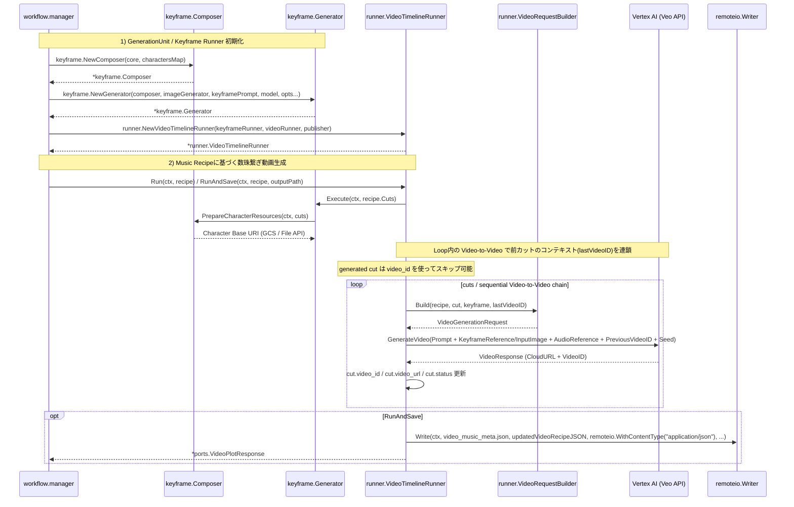

# 🎬 Go Veo Orchestrator

[](https://github.com/shouni/go-veo-orchestrator/actions/workflows/ci.yml)
[](https://golang.org/)
[](https://golang.org/)
[](https://github.com/shouni/go-veo-orchestrator/tags)
[](LICENSE)
[](https://pkg.go.dev/github.com/shouni/go-veo-orchestrator)

## 🚀 概要 (About) - Music Recipe Driven Veo Orchestrator

**Go Veo Orchestrator** は、**Music Recipe（音楽レシピ / 楽曲構成書）** から動画カット列を構造化し、Google の動画生成 AI **Veo (Vertex AI / Gemini API)** へ渡すためのバックエンドオーケストレーターです。

[Gemini Image Kit](https://github.com/shouni/gemini-image-kit) を使ってカットごとのキーフレームを生成し、`VideoRunner` adapter を通じて Veo に **Prompt / Keyframe / Audio / PreviousVideoID / Seed** を渡します。Veo API の具体実装は `ports.VideoRunner` として差し替える設計です。

`video_id` を次カットの `PreviousVideoID` として引き継ぐことで、Video-to-Video の文脈を保った連続カット生成を行います。生成済みカットは `status=generated` と `video_id` / `video_url` を使ってスキップできるため、途中失敗後の再開にも対応しやすい構造です。

---

## ✨ コア・コンセプト (Core Concepts)

* **🧬 Consistency Control**:
  * **キャラクター固有 Seed**、**キーフレーム画像**、**動きのプロンプト**、**前カットの VideoID** を 1 つの `VideoGenerationRequest` にまとめ、カット間の見た目と文脈を維持します。

* **⏳ Audio-Driven Timeline Logic (音楽主導のタイムライン管理)**:
  * `music_recipe.sections` または `cuts` から `duration_sec`、`start_sec`、`end_sec` を補完し、`audio_cue` を Veo 用プロンプトへ注入します。

* **🔁 Resumable Video Chain**:
  * 各 `cut` は `status`、`video_id`、`video_url` を保持します。生成済みカットは再生成せず、保持済み `video_id` を次カットの `PreviousVideoID` として使用します。

* **🧩 Adapter-Oriented Architecture**:
  * Veo への実通信は `ports.VideoRunner` に閉じ込め、オーケストレーション、キーフレーム生成、メタデータ保存を分離しています。

---

## 🎬 4つの動画生成ワークフロー (Workflows)

| ワークフロー | 担当インターフェース | 内容 |
| --- | --- | --- |
| **1. Scripting** | `ScriptRunner` | Music Recipe JSON を読み込み、歌詞・section・楽曲展開から、カット割り・カメラワーク・推定秒数を含む**Video Recipe**を生成。 |
| **2. Cut Keyframe Gen** | `CutKeyframeRunner` | 各カットのベースとなるキーフレーム画像を、キャラクター Seed と参照画像を使って生成（`RunAndSave`）。既存キーフレームの局所編集にも対応（`EditAndSave`、詳細は後述）。 |
| **3. Video Gen** | `VideoTimelineRunner` + `VideoRunner` | `VideoRequestBuilder` が `VideoGenerationRequest` を組み立て、Veo adapter に順次投入。 |
| **4. Metadata Publish** | `VideoPublishRunner` | `video_id` / `video_url` / `status` 更新済みの `video_music_meta.json` を保存。 |

---

## 🩹 単一カットのキーフレーム編集 (EditAndSave)

`CutKeyframeRunner.RunAndSave` はプロンプトから画像を作り直す「フル生成」ですが、`EditAndSave` は既存のキーフレーム画像を編集元として、テキスト指示で局所的な修正だけを反映します。構図・ポーズ・背景は保たれるため、同じキャラクターの他カットとの一貫性を保ったまま「小物の数を減らす」「色味を揃える」といった軽微な修正に向いています。

```go
// recipe は必ず 1 カットのみを含みます。対象カットの KeyframeReference は
// 既存の（編集元となる）キーフレーム画像を指している必要があります。
recipe := &ports.VideoRecipe{
	Cuts: []ports.Cut{
		{CutIndex: 2, CharacterID: "zundamon", KeyframeReference: "gs://bucket/jobs/j1/images/keyframe_2.png"},
	},
}

updated, err := workflows.CutKeyframe.EditAndSave(ctx, recipe, "腕には絆創膏を1〜2枚のみにしてください", "gs://bucket/jobs/j1/regens/cut-2/")
if err != nil {
	return err
}
// updated.Cuts[0].KeyframeReference が編集後の画像パスに更新されています。
```

内部的には [gemini-image-kit](https://github.com/shouni/gemini-image-kit) の `ImageGenerator.GenerateSingleImage` に既存キーフレーム画像を入力として渡し、`editPrompt` をプロンプトとして呼び出します。`RunAndSave`（通常のキーフレーム生成）と同じ会話型マルチモーダル画像モデル（`Config.ImageModel`、Gemini の「Nano Banana」系）をそのまま再利用するため、編集専用のモデルやAPIは不要です。

> Vertex AI Imagen のマスクベース編集/カスタマイズ API（`imagen-3.0-capability-001` 系）は2026年6月30日に廃止され、後継の「capability」モデルも用意されていません。そのため `EditAndSave` はマスク指定には対応せず、自由記述の編集指示のみをサポートします。

* `recipe.Cuts` が 1 件でない場合はエラー
* 対象カットの `KeyframeReference` が空の場合（＝編集元画像がない）はエラー
* キャラクターの Seed は `RunAndSave` と同様、`char.Seed` がそのまま編集リクエストに使われます

---

## 🔌 Adapter Boundary

このリポジトリは Veo API クライアントではなく、Veo に渡すための **ドメインモデル、キーフレーム生成、リクエスト構築、Video-to-Video 連鎖、メタデータ保存** を担当する orchestration ライブラリです。

Veo API への実通信は `ports.VideoRunner` の実装として、利用側アプリケーションまたは別パッケージから差し込みます。このリポジトリ内には本番用 Veo adapter は含めず、実行環境ごとの差分を adapter 側に閉じ込めます。

`VideoRunner` 実装が担う責務は以下です。

* Google Cloud / Vertex AI / Gemini API などの認証
* `ImageReference` / `AudioReference` の解決
* `InputImage` / `InputAudio` を使う場合のアップロードと参照 URI 化
* Veo API への動画生成リクエスト送信
* 長時間 operation のポーリング、タイムアウト、リトライ
* 生成動画の保存先管理
* 次カットへ引き継ぐための `VideoResponse.VideoID` 返却
* 参照可能な `VideoResponse.CloudURL` 返却

adapter 実装では `VideoGenerationRequest.ImageReference` を優先し、空の場合だけ `InputImage` をアップロードして参照 URI を作る想定です。`AudioReference` も同様に、参照 URI がある場合はそれを優先し、必要に応じて `InputAudio` をアップロードします。

`VideoRunner` を指定しない場合、`workflow.New` が返す `Workflows.Video` は `nil` になります。Design / Script / CutKeyframe / Publish だけを使う構成ではそのまま利用できますが、動画生成まで実行する場合は `ManagerArgs.VideoRunner` に実装を渡してください。

```go
type VeoRunner struct {
	// client, bucket, model, location など、実行環境に必要な依存を保持します。
}

func (r *VeoRunner) Run(ctx context.Context, req ports.VideoGenerationRequest) (*ports.VideoResponse, error) {
	// 1. req.ImageReference / req.AudioReference を優先して参照を解決
	// 2. 必要なら req.InputImage / req.InputAudio をアップロード
	// 3. req.Prompt, req.PreviousVideoID, req.Seed, req.DurationSec を Veo API に渡す
	// 4. operation を poll して完了を待つ
	// 5. CloudURL と VideoID を返す
	return &ports.VideoResponse{
		CloudURL:    "gs://example-bucket/videos/cut_001.mp4",
		VideoID:     "veo-video-id",
		CutIndex:    req.CutIndex,
		DurationSec: req.DurationSec,
		MimeType:    "video/mp4",
	}, nil
}

workflows, err := workflow.New(workflow.ManagerArgs{
	Config:      cfg,
	HTTPClient:  httpClient,
	Reader:      reader,
	Writer:      writer,
	AIClient:    geminiModel,
	VideoRunner: &VeoRunner{},
	PromptDeps:  promptDeps,
})
if err != nil {
	return err
}

result, err := workflows.Video.RunAndSave(ctx, recipe, "video_music_meta.json")
```

`VideoGenerationRequest` の主なフィールドは以下の契約で使われます。

| フィールド | adapter 側の扱い |
| --- | --- |
| `Prompt` | Veo に渡す最終プロンプト。カット内容、カメラワーク、音楽同期指示を含みます。 |
| `ImageReference` | 既に参照可能なキーフレーム画像 URI。存在する場合は `InputImage` より優先します。 |
| `InputImage` | `ImageReference` が空の場合に adapter 側でアップロードして使う画像バイト列です。 |
| `AudioReference` | 既に参照可能な音声セグメント URI。 |
| `InputAudio` | `AudioReference` が空の場合に adapter 側でアップロードして使う音声バイト列です。 |
| `PreviousVideoID` | 前カットの文脈を引き継ぐための ID。空の場合はチェーンなしで生成します。 |
| `Seed` | キャラクター Seed を優先し、未指定時は `music_recipe.Seed` を使います。 |
| `CutIndex` | レスポンスやエラー表示で使うカット番号です。 |
| `DurationSec` | カットの目標秒数です。 |

`VideoResponse.VideoID` が空の場合、そのカットの生成結果は保存できますが、次カットへの `PreviousVideoID` 連鎖は更新されません。連続カットの一貫性を重視する adapter では、可能な限り Veo 側の動画 ID を返してください。

---

## 🧾 Music Recipe JSON

`ScriptRunner` は `sourceURL` の Music Recipe JSON を `VideoRecipe` として解釈し、prompt builder へ parsed object を渡します。prompt builder は `music_recipe.lyrics` / `music_recipe.sections` から、BGM の拍子・感情・盛り上がりを含む動画台本 JSON を生成します。

歌詞本文は `music_recipe.lyrics` に保存されますが、Veo prompt へ直接は注入されません。歌詞や section の意味は、script generation stage の prompt builder が `cuts[].audio_cue` と `cuts[].visual_anchor` に展開します。

各 `cut` は `duration_sec` と `audio_cue` を持つため、Veo へのプロンプトには `(synchronized with the heavy bass drop at 0:10)` のような同期指示を自動注入できます。アプリ側の責務は、生成された `cuts` を表示・編集し、キーフレーム生成または動画生成フォームへ渡すことです。

```json
{
  "project_title": "AIマルチモーダル解説動画",
  "music_recipe": {
    "title": "AIマルチモーダル解説動画",
    "theme": "AIマルチモーダル解説",
    "mood": "90s retro mech synthwave",
    "tempo": 120,
    "lyrics": {
      "title": "AIマルチモーダル解説動画",
      "theme": "AIマルチモーダル解説",
      "hook": "未来の映像制作をひらく",
      "lyrics": "[Verse] 画面の奥で光が走る\n[Chorus] 未来のカットが動き出す",
      "keywords": [
        "AI",
        "video",
        "orchestration"
      ],
      "mood": "90s retro mech synthwave",
      "narrative": "AI が映像制作の工程をつなぐ物語"
    },
    "instruments": [
      "analog synth",
      "electronic drums"
    ],
    "sections": [
      {
        "name": "Intro",
        "duration_seconds": 5,
        "prompt": "quiet synth pad and clock tick"
      },
      {
        "name": "Verse",
        "duration_seconds": 5,
        "prompt": "drum beat starts and tempo lifts"
      },
      {
        "name": "Chorus",
        "duration_seconds": 5,
        "prompt": "bright synth lead and impact effects"
      }
    ]
  },
  "cuts": [
    {
      "cut_index": 1,
      "duration_sec": 5,
      "audio_cue": "イントロ：静かなシンセのパッド音、秒針の音 (mp3_segment_1)",
      "visual_anchor": "暗闇の中にキャラクターの瞳が光る。カメラがゆっくりと引いていく",
      "character_id": "zundamon"
    },
    {
      "cut_index": 2,
      "duration_sec": 5,
      "audio_cue": "Aメロ：歌詞の導入に合わせてドラムのビートが刻まれ始める。テンポアップ (mp3_segment_2)",
      "visual_anchor": "歌詞の「画面の奥で光が走る」を、ずんだもんの背後に走る光のラインとして映像化する",
      "character_id": "zundamon"
    },
    {
      "cut_index": 3,
      "duration_sec": 5,
      "audio_cue": "サビ：歌詞の hook に合わせて激しいシンセのメロディとエフェクト音が入る (mp3_segment_3)",
      "visual_anchor": "歌詞の「未来のカットが動き出す」を、カメラが高速旋回しながらサイバー空間へ切り替わる動きで表現する",
      "character_id": "zundamon_metan"
    }
  ]
}
```

この JSON は `Normalize()` により `start_sec` / `end_sec` / `status` が補完されます。生成後は `keyframe_reference`、`video_id`、`video_url` が追記された `video_music_meta.json` として保存されます。

Veo に渡る prompt は `cuts[].visual_anchor`、`cuts[].audio_cue`、`music_recipe.mood`、タイムライン情報から構築されます。`music_recipe.lyrics` はメタデータとして保持されますが、動画化したい歌詞の内容は `cuts` へ変換しておく必要があります。

`cuts` が空の場合は、`music_recipe.sections` からカット列を自動生成します。`music_recipe` は `github.com/shouni/go-gemini-client/lyria.MusicRecipe` をそのまま保持するため、楽曲生成側の JSON は `music_recipe` 配下へ入れます。

```json
{
  "project_title": "AIマルチモーダル解説動画",
  "music_recipe": {
    "title": "AIマルチモーダル解説動画",
    "theme": "AIマルチモーダル解説",
    "mood": "upbeat electronic documentary score",
    "tempo": 120,
    "instruments": [
      "analog synth",
      "electronic drums",
      "soft piano"
    ],
    "sections": [
      {
        "name": "Verse",
        "duration_seconds": 40,
        "prompt": "quiet opening with restrained melody and gradual rhythmic build"
      },
      {
        "name": "Chorus",
        "duration_seconds": 45,
        "prompt": "emotional peak with fuller instrumentation and stronger accents"
      }
    ],
    "AudioModel": "lyria-3-pro-preview",
    "ComposeMode": "game_fantasy",
    "Seed": 10
  },
  "cuts": []
}
```

---

## 📂 プロジェクト構造 (Project Structure)

本アーキテクチャは **ports による抽象化（Hexagonal Architecture）** を境界線としており、Veo API のエンドポイント変更や動画合成エンジンの差し替えを容易に行える設計を採用しています。

```text
go-veo-orchestrator/
├── workflow/    # 【統合管理】各工程を組み合わせ、Workflows インターフェースを実装。
├── runner/      # 【実行実体】Design/Script/CutKeyframe/VideoTimeline/Publish の具体的なプロセス実装。
├── keyframe/    # 【キーフレーム生成戦略】Music Recipe のカット列に基づくキャラクター一貫性つき静止画生成。
└── ports/       # 【契約・定義】Interface（VideoRunner等）、共通モデル、動作設定(Config)。全ての起点。

```

---

## 🔄 シーケンスフロー (Sequence Flow)

### Video Orchestration Flow (`NewVideoTimelineRunner`)



---

### 🤝 依存関係 (Dependencies)

* [shouni/gemini-image-kit](https://github.com/shouni/gemini-image-kit) - 静止画・キーフレーム生成コア基盤

### 📜 ライセンス (License)

このプロジェクトは [MIT License](https://opensource.org/licenses/MIT) の下で公開されています。
