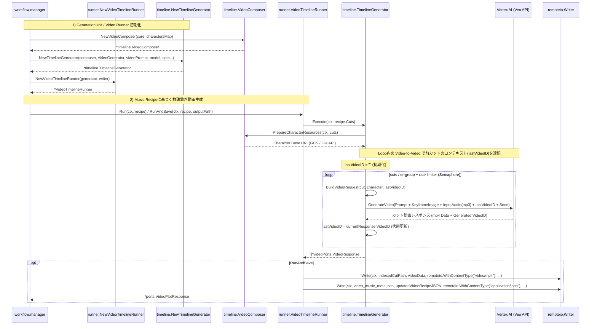

# 🎬 Go Veo Orchestrator

## 🚀 概要 (About) - キャラクターDNA維持・マルチモーダル動画生成Orchestrator

**Go Veo Orchestrator** は、**Music Recipe（音楽レシピ / 楽曲構成書）** を解析し、Googleの次世代動画生成AIである **Veo (Vertex AI / Gemini API)** を用いて、**キャラクターのDNA（一貫性）を完全に維持した楽曲同期型動画作品**を自動生成するための高度なバックエンドパイプラインです。

[Gemini Image Kit](https://github.com/shouni/gemini-image-kit) から派生した静止画生成コア技術を応用し、「プロンプト（テキスト）」「高精度静止画（キーフレーム）」「音源(mp3/wav)」「直前の動画（コンテキスト）」の4大要素（**マルチモーダル・クアッド・インプット**）を、BGMの拍子や時間軸（Timeline）に沿って統合管理します。

独自の **Video-to-Video 連鎖（数珠繋ぎ）生成アルゴリズム** により、シーンや楽曲の展開を跨いでもキャラクターの服装や容姿が崩れない、音ハメ精度の高い商業クオリティのアニメーション・動画パイプラインの構築を実現します。

---

## ✨ コア・コンセプト (Core Concepts)

* **🧬 Quad-Factor Consistency Control (4要素協調制御)**:
  * 動画AI（Veo）における最大の課題である「カットごとの容姿の破綻」を防ぐため、**キャラクター固有Seed**、**PanelGen由来の画像（キーフレーム）**、**動きの言語指示**、そして**前カットの動画コンテキスト**を同期させて1つのリクエストを構築します。

* **⏳ Audio-Driven Timeline Logic (音楽主導のタイムライン管理)**:
  * 従来の「コマ割り・レイアウト計算」を、Music Recipeに基づく「タイムライン・カット割り・音ハメ計算（テンポ/秒数制御）」へと再定義。楽曲の小節やオーディオキュー（Audio Cue）と映像の展開をプログラム側で決定論的にシンクロさせます。

* **🛡 Production-Ready Concurrency & Rate Control**:
  * セマフォ（Semaphore）を用いた細やかな並列実行制御に加え、大容量動画・音声アセットの通信を保護するため `singleflight` を活用。`RESOURCE_EXHAUSTED` (429) エラーや重複アップロードのオーバーヘッドを徹底的に排除します。

* **💾 Lean Data Architecture**:
  * HTMLなどのUI出力をバッサリと削ぎ落とし、純粋な動画データ（mp4）の結合処理と、楽曲展開・タイムスタンプおよびメタデータ（JSON記述の動画・音楽プロット）の出力・保存に完全特化しています。

---

## 🎬 5つの動画生成ワークフロー (Workflows)

| ワークフロー | 担当インターフェース | 内容 |
| --- | --- | --- |
| **1. Designing** | `DesignRunner` | キャラクターのDNA（Seed/ビジュアル特徴）を固定し、一貫性の基盤となるデザインシートを定義。 |
| **2. Scripting** | `ScriptRunner` | 非構造化ドキュメントから、キャラ設定・音楽展開（BGM拍子/Audio Cue）・カット割り・カメラワーク・推定秒数を含む**JSON形式のMusic & Video Recipe**を生成。 |
| **3. Cut Keyframe Gen** | `CutImageRunner` | 各カットのベースとなる高精度な「静止画（キーフレーム）」を、キャラ固有Seedを用いて個別に作画。 |
| **4. Video Gen** | `VideoTimelineRunner` + `VideoRunner` | Cut Keyframe Gen でできた画像、Scripting の動きプロンプト、前カットの `last_generated_video`、必要に応じた音源mp3を Veo API へ順次流し込み、Video-to-Video の文脈を維持した動画カットを生成。 |
| **5. Transcoding & Plot** | `VideoPublishRunner` | 生成された複数のカット動画（mp4）を統合・構造化し、最終動画アセットおよび音楽・映像同期用のメタデータJSONとしてパブリッシュ。 |

---

## 🧾 Music Recipe JSON

`ScriptRunner` はドキュメントから、映像指示だけでなく BGM の拍子・感情・盛り上がりを含む動画台本 JSON を生成します。各 `cut` は `duration_sec` と `audio_cue` を持つため、Veo へのプロンプトには `(synchronized with the heavy bass drop at 0:10)` のような同期指示を自動注入できます。

```json
{
  "project_title": "AIマルチモーダル解説動画",
  "music_recipe": {
    "tempo_bpm": 120,
    "total_duration_sec": 15,
    "style": "90s retro mech synthwave"
  },
  "cuts": [
    {
      "cut_index": 1,
      "duration_sec": 5,
      "audio_cue": "イントロ：静かなシンセのパッド音、秒針の音 (mp3_segment_1)",
      "visual_anchor": "暗闇の中にキャラクターの瞳が光る。カメラがゆっくりと引いていく",
      "character_id": "zundamon"
    },
    {
      "cut_index": 2,
      "duration_sec": 5,
      "audio_cue": "Aメロ：ドラムのビートが刻まれ始める。テンポアップ (mp3_segment_2)",
      "visual_anchor": "ずんだもんが自信満々に人差し指を立てて、カメラに向かって喋る",
      "character_id": "zundamon"
    },
    {
      "cut_index": 3,
      "duration_sec": 5,
      "audio_cue": "サビ：激しいシンセのメロディ、エフェクト音 (mp3_segment_3)",
      "visual_anchor": "カメラが高速で旋回し、背景がサイバー空間へと切り替わる",
      "character_id": "zundamon_metan"
    }
  ]
}
```

この JSON は保存時に `video_music_meta.json` として出力され、`start_sec` / `end_sec` が補完されたカット列を後段の ffmpeg 結合や検証に渡せる構造になります。

楽曲生成側の JSON が `sections` ベースで届く場合も、そのまま受け付けます。`sections` の要素数は固定せず、各 section の `duration_seconds` から `cuts` を自動生成し、`tempo` / `mood` は `music_recipe.tempo_bpm` / `music_recipe.style` に同期されます。

```json
{
  "title": "碧き残影、一瞬の奇跡 〜黒き疾風の叙事詩〜",
  "theme": "闇を裂き、最速の奇跡を刻む青き瞳の誓い",
  "mood": "Epic Symphonic Fantasy Rock Ballad, Emotional and Melancholic",
  "tempo": 72,
  "instruments": [
    "Acoustic Grand Piano",
    "Soaring Full Strings Section",
    "Progressive Rock Electric Guitar"
  ],
  "sections": [
    {
      "name": "Verse",
      "duration_seconds": 40,
      "prompt": "[Silent Awakening] Focus strictly on the first lyrics block marked [Verse]."
    },
    {
      "name": "Chorus",
      "duration_seconds": 45,
      "prompt": "[Emotional Outburst & High-Voltage Peak] Focus on the lyrics marked [Chorus]."
    }
  ],
  "audio_model": "lyria-3-pro-preview",
  "compose_mode": "game_fantasy",
  "seed": 10
}
```

---

## 📂 プロジェクト構造 (Project Structure)

本アーキテクチャは **ports による抽象化（Hexagonal Architecture）** を境界線としており、Veo API のエンドポイント変更や動画合成エンジンの差し替えを容易に行える設計を採用しています。

```text
go-veo-orchestrator/
├── workflow/    # 【統合管理】各工程を組み合わせ、Workflows インターフェースを実装。
├── runner/      # 【実行実体】Design/Script/CutKeyframe/VideoTimeline/Publish の具体的なプロセス実装。
├── layout/      # 【キーフレーム生成戦略】Music Recipe のカット列に基づくキャラクター一貫性つき静止画生成。
└── ports/       # 【契約・定義】Interface（VideoRunner等）、共通モデル、動作設定(Config)。全ての起点。

```

---

## 🔄 シーケンスフロー (Sequence Flow)

### Video Orchestration Flow (`NewVideoTimelineRunner`)



---

### 🤝 依存関係 (Dependencies)

* [shouni/gemini-image-kit](https://github.com/shouni/gemini-image-kit) - 静止画・キーフレーム生成コア基盤

### 📜 ライセンス (License)

このプロジェクトは [MIT License](https://opensource.org/licenses/MIT) の下で非公開・クローズド開発用として運用、またはポートフォリオ契約に基づいてライセンスされます。
