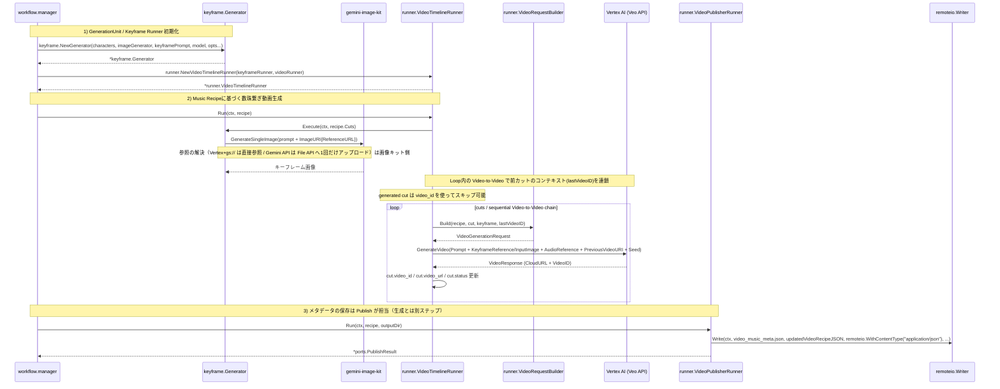

# 📂 アーキテクチャ

[← README](../README.md)

## プロジェクト構造

本アーキテクチャは **ports による抽象化（Hexagonal Architecture）** を境界線としており、Veo API のエンドポイント変更や動画合成エンジンの差し替えを容易に行える設計を採用しています。

```text
go-veo-orchestrator/
├── workflow/    # 【統合管理】各工程を組み合わせ、Workflows インターフェースを実装。
├── runner/      # 【実行実体】NewVideoScriptRunner / NewCutKeyframeRunner / NewVideoTimelineRunner /
│              #   NewVideoPublisherRunner。Veo リクエストの組み立ては NewVideoRequestBuilder
│              #   （キャラクター参照を含める場合は NewVideoRequestBuilderWithCharacters、
│              #   差し替えは WithRequestBuilder。既定は DefaultVideoRequestBuilder）。
├── keyframe/    # 【キーフレーム生成戦略】カット列からの静止画生成（並列度・レート制限つき）。参照画像の解決は gemini-image-kit。
└── ports/       # 【契約・定義】Interface（VideoRunner等）、共通モデル、動作設定(Config)。全ての起点。
```

## 💾 生成と保存の責務分担

書き先は `remoteio.Writer` として注入されるため、このライブラリは GCS も S3 も知りません。持っているのは「どこに保存するか」ではなく、**自分のフォーマットと命名規則**です。その上で、キーフレームと動画で意図的に扱いを分けています。

| | 生成 | 保存 |
| --- | --- | --- |
| キーフレーム | `CutKeyframeRunner.Run` | **同じ Runner が行う**（`RunAndSave` / `EditAndSave`） |
| 動画 | `VideoTimelineRunner.Run` | **行わない**。呼び出し側が `VideoPublishRunner`（`Workflows.Publish`）を呼びます |

**キーフレームの保存を Runner が持つ理由**: 保存名 `keyframe_<レシピ内の位置>.png` がカットの並びと結びついているためです。呼び出し側に出すと、位置→ファイル名の対応と `keyframe_reference` の設定を再実装させることになり、部分生成時に `keyframe_1.png` が別のカットを指す事故を招きます。

**動画の保存を持たない理由**: 生成直後に保存すると、生成と保存の間に処理を挟む呼び出し側が困るからです。例えば継続チェーンを結合して `final_video_url` を埋めてから保存したい場合、タイムライン側が書いたメタデータには必ずその値が欠けます。（以前は `VideoTimelineRunner.RunAndSave` がありましたが、この理由でどの呼び出し元も使っておらず、削除しました。）

## 🔄 シーケンスフロー

### Video Orchestration Flow (`NewVideoTimelineRunner`)


