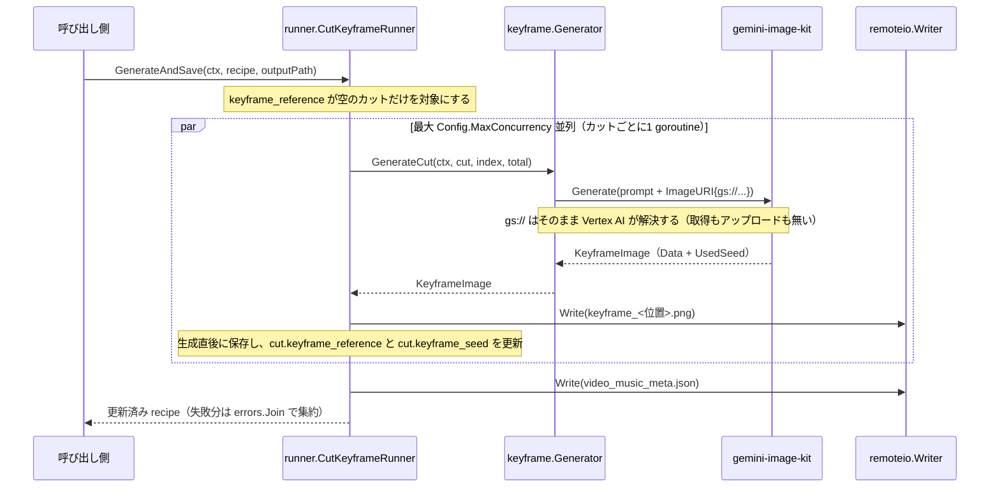
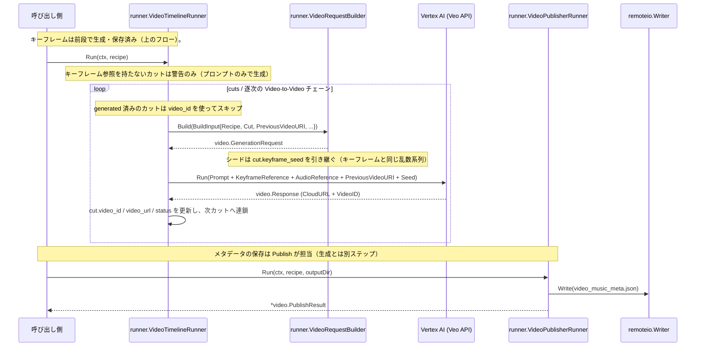

# 📂 アーキテクチャ

[← README](../README.md)

## プロジェクト構造

本アーキテクチャは **ports による抽象化（Hexagonal Architecture）** を境界線としており、Veo API のエンドポイント変更や動画合成エンジンの差し替えを容易に行える設計を採用しています。

```text
go-veo-orchestrator/
├── video/       # 【ドメインモデル】Recipe / Cut / GenerationRequest / Response /
│                #   KeyframeImage / PublishResult。何にも依存しない最下層。
├── ports/       # 【契約】VideoRunner・各 Prompt・ContentReader・4つの Runner
│                #   インターフェース・Workflows・Config・センチネルエラー。
├── veo/         # 【Veo の制約】モード判定（ClassifyRequest）、モード別の許容尺、
│                #   カット分割の計画。API 呼び出しは行わない。
├── internal/keyframe/  # 【1カット分の画像生成】プロンプト組み立てと送信のみ。
├── internal/runner/    # 【実行実体】VideoScriptRunner / CutKeyframeRunner /
│                       #   VideoTimelineRunner（+ VideoRequestBuilder）/ VideoPublisherRunner。
│                       #   キーフレームの並列度と保存はここが持つ。
└── workflow/    # 【統合管理】workflow.New が全 Runner を組み立てて Workflows を返す。
                 #   レート制限・タイムアウト・singleflight もここ。
```

依存は `video → ports → veo → internal/{keyframe, runner} → workflow` の一方通行です。公開パッケージは `video` / `ports` / `veo` / `workflow` の4つで、`keyframe` と `runner` は `internal/` にあります（消費側は `workflow.New` と `ports` のインターフェースだけで足りるためです）。


## 💾 生成と保存の責務分担

書き先は `remoteio.Writer` として注入されるため、このライブラリは GCS も S3 も知りません。持っているのは「どこに保存するか」ではなく、**自分のフォーマットと命名規則**です。その上で、キーフレームと動画で意図的に扱いを分けています。

| | 生成 | 保存 |
| --- | --- | --- |
| キーフレーム | `CutKeyframeRunner` | **同じ Runner が、1 枚生成するたびに行う**（`GenerateAndSave` / `EditAndSave`） |
| 動画 | `VideoTimelineRunner.Run` | **行わない**。呼び出し側が `VideoPublishRunner`（`Workflows.Publish`）を呼びます |

**キーフレームの保存を Runner が持つ理由**: 保存名 `keyframe_<レシピ内の位置>.png` がカットの並びと結びついているためです。呼び出し側に出すと、位置→ファイル名の対応と `keyframe_reference` の設定を再実装させることになり、部分生成時に `keyframe_1.png` が別のカットを指す事故を招きます。

**1 枚ごとに保存する理由**: まとめて生成してから保存すると、その間にプロセスが落ちた場合（Cloud Run のタイムアウト・デプロイ・OOM）に生成済み＝課金済みの画像がメモリごと消えます。1 枚ずつ保存していれば失うのは最大 1 枚で、レシピの `keyframe_reference` を見て続きから再開できます。カットごとの goroutine が生成から保存までを完結させるため、**注入する `remoteio.Writer` は同時アクセス安全である必要があります**（`Config.MaxConcurrency` が 2 以上のとき）。

**動画の保存を持たない理由**: 生成直後に保存すると、生成と保存の間に処理を挟む呼び出し側が困るからです。例えば継続チェーンを結合して `final_video_url` を埋めてから保存したい場合、タイムライン側が書いたメタデータには必ずその値が欠けます。（以前は `VideoTimelineRunner.GenerateAndSave` がありましたが、この理由でどの呼び出し元も使っておらず、削除しました。）

## 🔄 シーケンスフロー

### Keyframe Flow (`CutKeyframeRunner.GenerateAndSave`)



### Video Orchestration Flow (`NewVideoTimelineRunner`)



